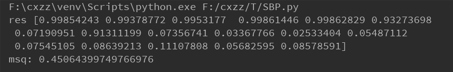

完成机器学习5.5习题内容

试编程实现标准bp算法和累积pb算法，在西瓜数据集3.0上分别用这两个算法训练一个单隐层的网络并进行比较

代码托管在：https://github.com/chenxianzhao/MachineLearning/tree/master/BP

西瓜数据预处理：

​         由于数据是中文编码，手动进行数值编码，对色泽从浅到深，根蒂蜷缩的程度，敲声的沉闷程度，纹理的清晰程度，脐部的凹陷程度 触感的手感重新编码为存在偏序关系的{0,1,2}，对密度和含糖量本来就是实数的数据不做处理，对好瓜标记为1，坏瓜标记为0做数据预处理。

模型设计：

​         输入层含有7个节点，分别对应西瓜的7个属性，隐藏层设置了10个节点，输出层有1个节点，对应西瓜的类别。还有变量学习率。

算法流程：

​         参照《机器学习》p104，使用python的numpy库实现矩阵相关运算。首先求出输出，然后更新g，e矩阵 ，更新delta矩阵，更新权值和阈值矩阵。

实验结果：

​         学习轮数500；

​         在学习率为0.5，0.1，0.8，0.9都进行了测试发现对实验的结果影响并不明显，均方误差在0.45附近浮动，实验多次观察到数据拟合得较好，但是会出现低7个数据本该是好瓜却被分类成坏瓜的情况，出现次数不只一次，应该是陷入了局部最优解无法跳出导致7号瓜分类错误。

 

​         如上图7号瓜为0.07190951被分类为坏瓜

​	累积pb算法：ABP

​         对更新的逻辑稍做修改，统一跑完一轮数据后再修改

​         发现速度上与标准bp算法差不多，应该是因为数据集太小发挥不出优势，均方误差也是在0.45左右浮动，试了30多次也没出现误分类7号瓜，比标准bp算法更不易陷入局部最优解。