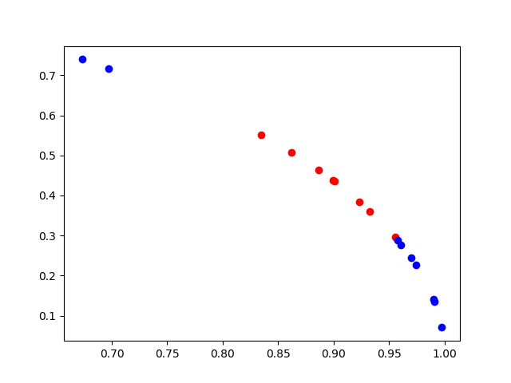
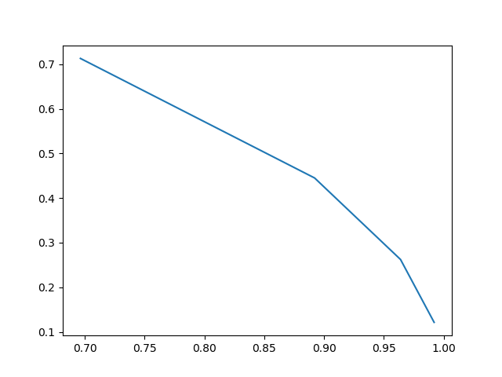

完成《机器学习》习题5.8从网上下载或自己编程实现som网络，并观察其在西瓜数据集3.0a上产生的结果。

代码托管在：https://github.com/chenxianzhao/MachineLearning/tree/master/SOM

因为书上关于som 的实现一笔带过，因此我的实现参考bham的课件：http://www.cs.bham.ac.uk/~jxb/NN/l16.pdf

课件主要内容：

​         首先明确som是无监督学习方法，而且som是基于竞争学习的，也就是任何时刻只有一个神经元被激活，其他神经元被抑制。

​         另外som另一个特点是拓扑有序的映射，也就是说如果是2维的竞争神经元，当x被激活时，处在x附近的神经元会根据距离的长短受到不同的影响。

​         一般来说我们会选择一维或者二维作为竞争层的结构，因此som也有降维的特点。

算法流程：

​         初始化所有的连接权重

​         对于每一个输入，我们去找 欧式距离最近/夹角最小(余弦最大) 的神经元作为激活神经元

​         这个激活的神经元会导致周围的神经元被激活

​         根据我们自己定义的拓扑距离更新激活神经元和附近的神经元

模型建立：

​         对我们要解决的问题是对西瓜数据集3.0a进行聚类分析，输入的维度是2，因此我们的输入层有2个节点，然后根据我们的问题，我设计了4个竞争神经元并且是以线性排布的，即一维。

实现细节：

​         注意数据和权值都要单位化处理，即向量要除以2范数，然后这个拓扑距离的的描述我们实际上两个神经元的距离描述（这个距离不是权值的距离，而是在真实模型下的距离，比如隔了0，1，2，3..个神经元）。然后这个拓扑距离带来的影响是会随着迭代次数不断减少的，其物理意义表现在不断缩小激活神经元对周围神经元的影响程度，使结果收敛。

​         然后学习率也是个随时间衰减的变量，也是为了能使结果收敛。

​         这个调整策略其实很简单，本质上就是激活的神经元沿着 朝向数据点的方向移动一段距离 这个距离受学习率和与激活神经元拓扑关系的影响。

​         课件里有个例子详细的说明的4个1维的竞争神经元是怎么拟合4个数据点的，这里不再赘述。

实验结果：

​         这是数据归一化后的图，红色代表好瓜 蓝色代表坏瓜

​         可以看到归一化后的瓜数据呈弧线排布，两端是坏瓜中间是好瓜

​         下图是5个竞争神经元的图，相连表示这两个神经元在结构上相邻

这图的含义是我们用4个竞争神经元去试图给输入的数据进行聚类，每个神经元相当于聚类的中心，因为神经元会被聚类附近的神经元激活，然后图像呈线性排布的原因是我们设定的是一维的拓扑结构竞争层，然后好瓜倾向于激活1号神经元，坏瓜倾向于激活0号3号神经元，这样就能把好瓜和坏瓜区分开来，把二位的数据降维为带有拓扑结构的一维数据。